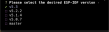

Installation of IDF
===============================
Installing the ESP-IDF using the Espressif Installation Manager (EIM) is a straightforward process. Begin by opening your preferred command shell (PowerShell is recommended for Windows users) and running EIM. You can specify your installation preferences using any of the available configuration <configuration> methods. If any required options are not specified, an interactive wizard will guide you through the remaining steps.

Wizard steps
===============================

Prerequisities check
-------------------------
The installer will first verify that all prerequisites are met. If any prerequisites are not satisfied, the installer will either prompt you to address them manually (on POSIX systems) or offer an option for automatic installation.

A similar check will be performed for Python. EIM will verify the presence of Python, its ability to create a virtual environment, and its capacity to establish SSL connections. If the Python sanity check fails, you will be prompted to configure Python manually (on Linux and macOS) or offered an automated Python setup (on Windows).

Platform selections
-------------------------
Next step involves selecting the Espressif chips you wish to develop for. This is a multi-select question, with the default option set to `all`. You can deselect this option (using the space bar) and choose specific chips as needed. Once your selection is complete, proceed by pressing the Enter key.

IDF version selections
-------------------------
In the second step, you can choose from a list of supported ESP-IDF versions. While multiple versions can be selected, it is recommended to use the latest supported version, which is selected by default.

Mirrors selections
-------------------------
You will then be prompted to select a mirror from which the ESP-IDF should be downloaded. For users in mainland China, it is advisable to avoid selecting GitHub.

Subsequently, you will be asked to select a mirror for downloading the necessary tools. You may choose between GitHub or your company's mirror.

Instalation path selections
---------------------------
In the next step, you will be prompted to enter the installation path for the ESP-IDF. The default path is `C:\esp` on Windows and `~\.espressif` on POSIX systems. It is recommended to specify the full path.

Config save
-------------------------
As the last step is the installer will ask you if you wanf to save instalation config. This can be later used to repeat the instalation. It can be also shared and used by other user to achcieve the same instalation as yours.

Finish
-------------------------

After Installation 
===============================

Windows
-------------------------
On Windows, the installer creates an icon on your desktop labeled IDF_PowerShell. Clicking this icon will launch PowerShell with the environment set up, allowing you to start using ESP-IDF immediately. If you've installed multiple versions of ESP-IDF, you will have multiple icons, one for each version.

macOS & Linux
---------------------------------
In the installation directory you selected, there will be a .sh script that, when sourced, activates the ESP-IDF environment in your current shell. It's important to note that this script should be sourced, not executed directly. If you've installed multiple versions of ESP-IDF, there will be a separate script for each version.

.. note::

    The script should be really sourced and not executed
