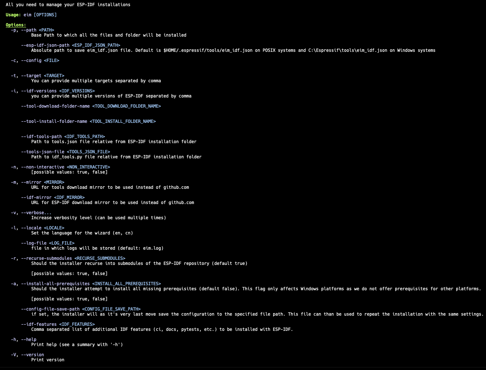

# Configuration

Configuration can be done in several ways. The priority order is as follows: configuration files are overridden by environment variables, which in turn can be overridden by command-line arguments. If you go through the wizard, the choices you make there will take the highest precedence.

## Wizard

To start the wizard, simply run `eim` without any parameters. The wizard will guide you through the installation process. Generally, you can use the arrow keys to navigate between options, the spacebar to select options, and the Enter key to confirm your selections.

As the final step, the wizard will allow you to save your installation choices as a configuration file. This file can be shared or reused in future installations to replicate the same setup.

## Command Line Arguments

The easiest way to see all possible command-line arguments is to run `eim --help`, which will display the following help screen:



## Config File

The installer can use a TOML configuration file. By default, it looks for this file at `./config/default.toml`, but you can specify a different path using the `--config` command-line argument.

Here is an example of what a configuration file might look like:

```toml
path = "/tmp/esp-new/"
idf_path = "/tmp/esp-new/v5.4/esp-idf"
esp_idf_json_path = "/Users/petrgadorek/.espressif/tools"
tool_download_folder_name = "dist"
tool_install_folder_name = "tools"
target = ["all"]
idf_versions = ["v5.4"]
tools_json_file = "tools/tools.json"
idf_tools_path = "tools/idf_tools.py"
config_file_save_path = "eim_config.toml"
non_interactive = false
wizard_all_questions = false
mirror = "https://github.com"
idf_mirror = "https://github.com"
recurse_submodules = true
install_all_prerequisites = false
```

## Environment Variables

You can override any of the configuration settings by exporting environment variables prefixed with ESP\_. For example, to override the target setting, you would use ESP_TARGET.
